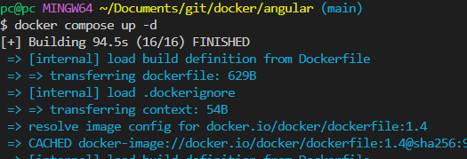
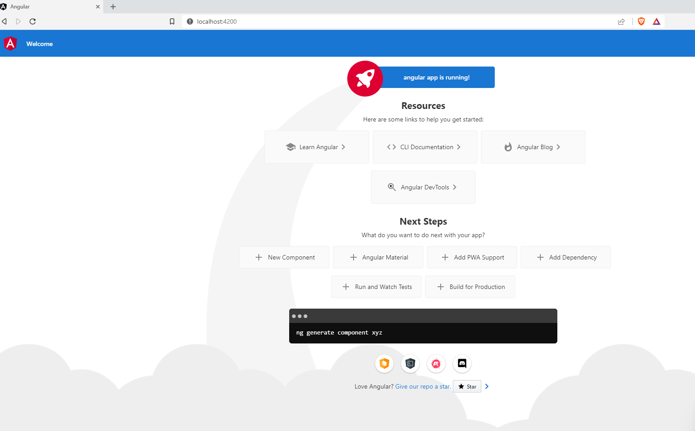

## Compose sample 

### Use with Docker Development Environments

Example of using Dockerfile  and docker-compose together.


You can open this sample in the Dev Environments feature of Docker Desktop version 4.15 or later.

[Open in Docker Dev Environments ](https://open.docker.com/dashboard/dev-envs?url=https://github.com/docker/awesome-compose/tree/master/angular)

### Angular service

Project structure:
```
.
├── angular
│   ├── Dockerfile
│   ├── ...
│   ├── ...
│   ....
└── compose.yaml
```

[_compose.yaml_](compose.yaml)
```
services:
  web:
    build: angular
    ports:
    - 4200:4200
    ...

```

The compose file sets up an application with a single service called `angular.` The image for this service is constructed using the Dockerfile located within the `angular` directory (as specified by the "build" parameter).

 When deploying the application, docker compose connects the container's port 4200 to the host's port 4200, as specified in the file. Be sure that port 4200 is not already in use by another container, otherwise you should change the port number.


## Deploy with docker compose

```
$ docker compose up -d

```


## Expected result

Listing containers must show a container running and the port mapping as below:
```
$ docker ps
CONTAINER ID   IMAGE         COMMAND                  CREATED          STATUS          PORTS                    NAMES
bfe1068f97e7   angular-web   "docker-entrypoint.s…"   12 minutes ago   Up 11 minutes   0.0.0.0:4200->4200/tcp   angular-web-1

```

After the application starts, navigate to `http://localhost:4200` in your web browser.



Stop and remove the container

```
$ docker compose down
```
